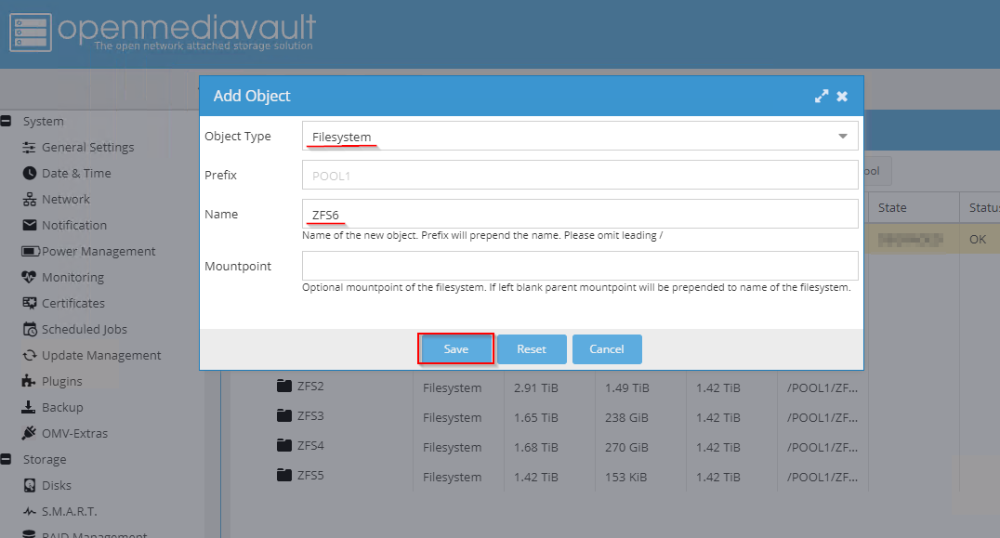

Time has come for a quick Nas setup. I just write this guide for later reference.

## 1. System Installation
Downloading the original iso file from the main project webpage. Once we downloaded the system image, create an usb stick and booy your system from it. The install procedure will start.

## 2. Installing Extra Plugins
After the installation, I like to install the extra plugins. For that we need to ssh inside our box and execute the folowing comands:

    sudo wget -O - https://github.com/OpenMediaVault-Plugin-Developers/ packages/raw/master/install | sudo bash sudo apt update

Once added the repository, we can see new plugins list.

## 3. Enabling ZFS
Zfs is not enabled by default in our OMV, but we can easily activate it.

*System -> OMV-Extras -> Kernel -> Install Proxmox Kernel*

*System -> Plugins -> openmediavault-zfs 5.0.1 -> install*

## 4. Create a ZFS Pool
Look for "ZFS" on the menu on the right, the click new POOL and give it a name.

Once the pool is created, click on new filesystem.

## 5. Scheduled Snapshots
Snapshots are one of the best features of zfs, we can schedule when the snapshot take place, and for how long will be retained.

