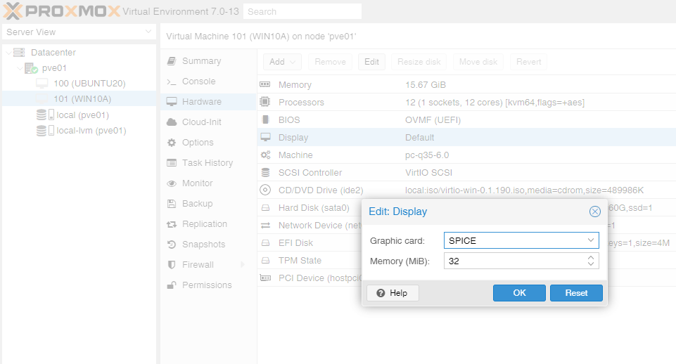
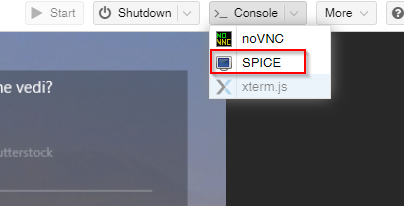

When using Proxmox as your favorite virtualization platform, you will come across the need to connect to your VMs. In case of a Windows VM, the classic way to do it may be to activate RDP from within your Windows VM and connect through it. But a more open source solution can be to configure the Spice protocol to access to your development machines.

# Spice Protocol
To keep it super simple and basic, it's composed of four elements:
- a graphic server
- a client
- and two ... hemm let's say ... "connectors", that will fill the gap between host and guest OSes.

# Windows Guest Configuration
Befor activating the Spice Protocol, be sure have installed the necessary drivers on your windows guest.
To do so, install the **spice-guest-tools** that you can find at the following link:
https://www.spice-space.org/download.html

# Windows Host
To connect to your Windows VM  from your Windows machine, you will need a "Spice Viewer".
To do so, you can download and install the **virt-viewer** for you windows from the following link:
https://virt-manager.org/download/ 

# Proxmox Configuration
At this point, turn off you guest to make some virtual hardware changes.
In your Proxmox Ve web portal navigate to your 

*your VM -> Hardware -> Display*

Select **Spice** from dropdown menu and 32 MB of video memory, the click **OK**

You can the start your VM, and once its up and running, click on *Console -> Spice* to start the remote session.

Next up, performance optimization.