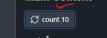

We are going to create a Desktop App using web tecnologies. Here a list of tools we are going to use:

    - node js
    - vite
    - blueprint js
    - CSS Grid
    - electron js

# Setup

First thing first, we will install the lastest stable node environment. Download and install Node from the official website https://nodejs.org/

Once installed text your setup with the following command

    node --version
    v20.11.0

We start our new project using the **vite** framework 

    npm create vite

It will ask you the name of your project and then select the type of environment that you want to use.

We choose to use "**React**" with "**Typescript+SWC**". SWC is a fast and new  Rust-based bundler. Onece finished the setup o inside the folder newly created

    cd project-name
    npm run dev

# Install Blueprintsjs

We will use the Blueprintjs as a our UI framework you can refer o the original documenation here: https://blueprintjs.com/docs/

In the comand prompt insall the Blueprintjs packages:

    npm add @blueprintjs/core 
    npm add @blueprintjs/datetime2
    npm add @blueprintjs/icons
    npm add @blueprintjs/select
    npm add @blueprintjs/table

Then we will import our freshly installed modules in the *src/App.tsx* add the folowing lines:

    // include core package
    import { Button } from "@blueprintjs/core"

    import "@blueprintjs/core/lib/css/blueprint.css";
    // include blueprint-icons.css for icon font support and other css files
    import "@blueprintjs/icons/lib/css/blueprint-icons.css";
    import "@blueprintjs/datetime2/lib/css/blueprint-datetime2.css";
    import "@blueprintjs/select/lib/css/blueprint-select.css";
    import "@blueprintjs/table/lib/css/table.css";

We will now deactivate the default blue outline while we interact with the mouse.

To do so, import the *FocusStyleManager* from the core package and the toggle the option:

    import { Button, FocusStyleManager } from "@blueprintjs/core"
    FocusStyleManager.onlyShowFocusOnTabs();

# Insall and configure Sass pre-processor

In the command prompt insall the dart-sass package

    npm add -D sass

then in the **vite.config.ts** at the root of our project we will configure the sass preprocessor:

    css: {
        preprocessorOptions: {
            scss: {
                additionalData: `@import "@blueprintjs/core/lib/scss/variables.scss";`
            }
        }
    },

The final result will be:

    import { defineConfig } from 'vite'
    import react from '@vitejs/plugin-react-swc'

    // https://vitejs.dev/config/
    export default defineConfig({
    css: {
        preprocessorOptions: {
            scss: {
                additionalData: `@import "@blueprintjs/core/lib/scss/variables.scss";`
            }
        }
    },
    plugins: [react()],
    })

